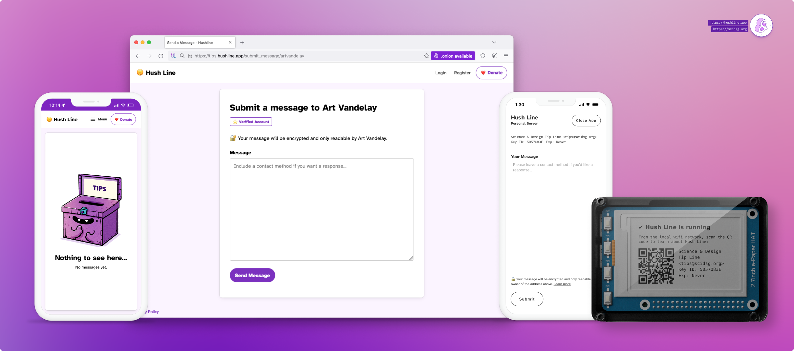

# Getting Started With Hush Line

Hush Line is a free and open-source, anonymous-tip-line-as-a-service for organizations or individuals. It's intended for journalists and newsrooms to offer a public tip line; by educators and school administrators to provide students with a safe way to report potentially sensitive information, or employers, Board rooms, and C-suites for anonymous employee reporting.

## Contents

1. [Software](#software)
2. [Email Encryption](#email-encryption)
3. [SMTP Settings and App Passwords](#smtp-settings-and-app-passwords)

## Prerequisites

### 1. Email

For Hush Line to email your message, you'll need SMTP information from your mail provider. We'll use Gmail for its high reliability. If you don't already have an account, create one. Maintaining an email address separate from your personal account is a good practice.

You should never use your primary account password; instead, create app-specific passwords. These are purpose-made for single applications.

#### 1.1. Create an app password

From your Gmail account, click on your avatar to access your account-level options. Select `Manage Google Account`.

Next, click on the Security tab on the left, then scroll to the bottom of the page to find App Passwords.

Click on App Passwords, then enter a name, then click Create. A dialog will pop up with your app-specific password. Copy it to a notepad for easy access.

#### 1.2. SMTP Settings

##### Gmail SMTP
- Server: `smtp.gmail.com`
- Port: `587` or `465`

##### Riseup.net SMTP
- Server: `mail.riseup.net`
- Port: `587` or `465`

### 2. Mailvelope

To decrypt Hush Line messages, we'll use Mailvelope, which integrates with Gmail, adding PGP functionality; add the extension to [Firefox](https://addons.mozilla.org/en-US/firefox/addon/mailvelope/) or [Chrome](https://chrome.google.com/webstore/detail/mailvelope/kajibbejlbohfaggdiogboambcijhkke).

Open the extension in your browser and click "Let's Start."

#### 2.1. Create your keys

Click on "Generate Keys." Give your key a name, enter your Gmail address, and create a strong password.

#### 2.2. Verify your email address

Before using your key, you'll have to verify your email address. Look for a message from `Mailvelope Key Server` in your Gmail inbox.

The message is encrypted, and when opened, you'll be prompted for your Mailvelope password to read the email. After entering your password, click the link.

#### 2.3. Copy your PGP key

After confirming that your email was verified, click on the supplied URL.

Your PGP Key is in the grey box, beginning with `-----BEGIN PGP PUBLIC KEY BLOCK-----` and ending with `-----END PGP PUBLIC KEY BLOCK-----`. Copy your entire key into a notepad for easy access.

### 4. Tor Browser (Optional)

For users with advanced privacy needs, including IP address obfuscation, which hides your physical location, download [Tor Browser](https://torproject.org/download). Hush Line has an onion address, and when you connect to it using Tor Browser, you receive the greatest level of protections.

🎉 Congratulations, you're now ready to continue with Hush Line!
