# Hush Line Managed Service

The hosted version of Hush Line is the first free and open-source anonymous tip-line-as-a-service and the easiest way to get started. It's as simple as signing up, and you'll have a way for anyone to send you a private message. It's for those needing one or more tip lines without worrying about managing and maintaining technical infrastructure.

## Contents

1. [Register](#register)
2. [Log In](#log-in)
3. [Verified Accounts](#verified-accounts)
4. [Sending Messages](#sending-messages)
5. [Reading Messages](#reading-messages)
6. [Settings](#settings)
7. [Admin View](#admin-view)
8. [Paid Features](#paid-features)

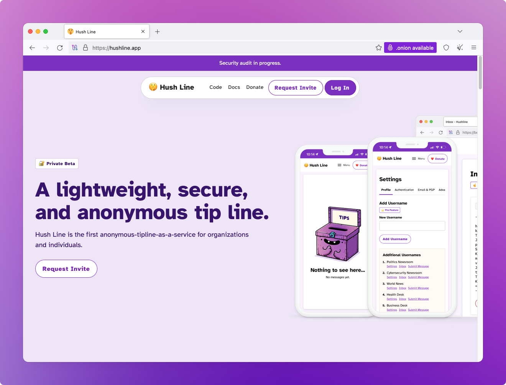

## Register

Before public launch of Hush Line, you'll need an invite code to create an account. Codes are distributed upon request. Once you have the invite code, register your account at https://tips.hushline.app/register.

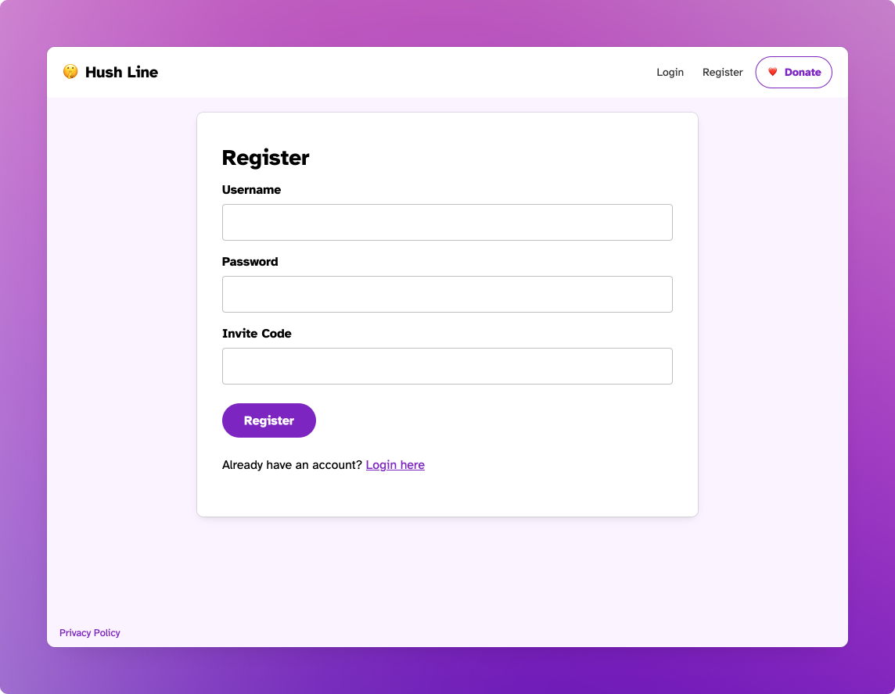

## Log In

After creating your account, you'll be redirected to the login page. Enter the username and password you just created.

Note: To protect your privacy, we don't require any PII, including your email address or phone number.

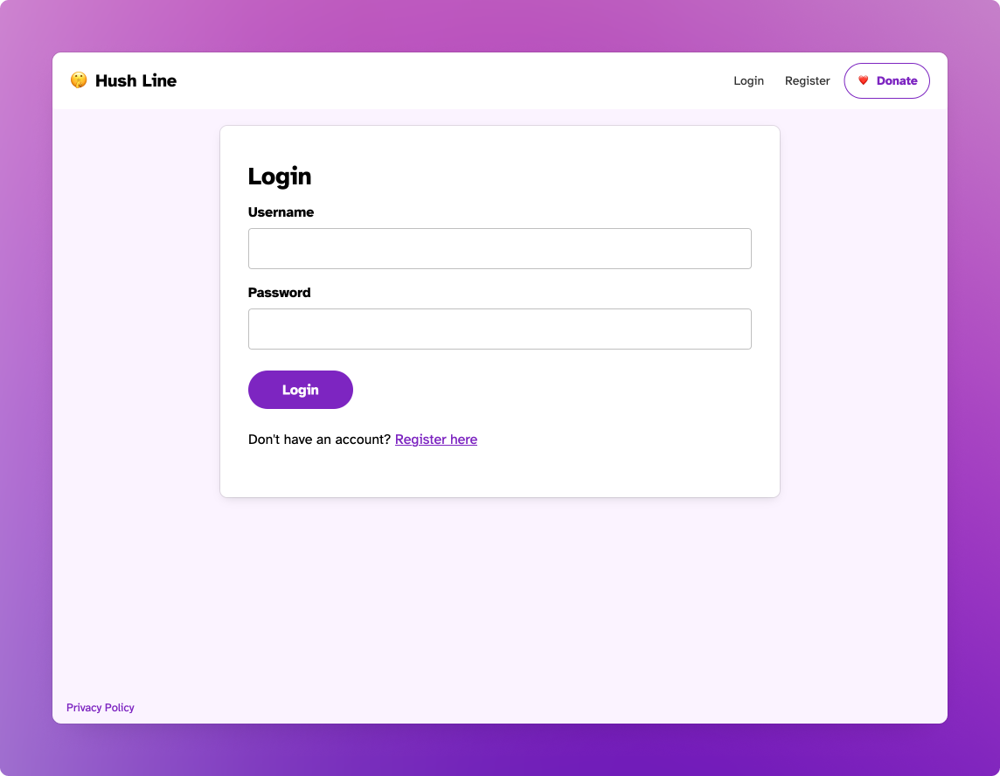

## Verified Accounts

At Hush Line, we're committed to building a trusted community where communication is secure and identities are verified. Our verified accounts feature is designed to ensure that messages reach their intended recipients, fostering a reliable environment for all users. Verified accounts are specially available for:

- 🕵️ **Journalists** - Reporters, correspondents, and investigative journalists.
- 📰 **Newsrooms** - Official accounts for newspapers, TV stations, or online news portals.
- ✊ **Activists** - Individuals or groups advocating for social, environmental, or political causes.
- 📸 **Public Figures** - Politicians or other noteworthy public individuals.
- 📊 **Businesses** - Companies, small businesses, or startups aiming to communicate with their audience.

### Requesting Verification

To ensure your account is recognized as authentic, users belonging to the categories listed above can apply for verification. Follow these steps to initiate the verification process:

1. **Send a Message:** Use the contact form in the app to reach out to us. Include your name or organization's name and a preferred method of contact (email or phone number). We'll get back to you to schedule a verification meeting.
2. **Prepare Your Documents:** To verify your identity or your authority to represent an organization, please include the relevant documents for your role:
   - **A Valid ID:** Government-issued identification that shows your full name and photo.
   - **Proof of Employment or Association:** A letter from your employer or organization confirming your role or a recent pay stub.
   - **An Active Profile:** A link to your profile on your employer's or organization's official website, verifying your position or role.
   - **Published Articles:** For journalists, links to your articles published on recognized news websites.
   - **Proof of Authority:** For those representing organizations, a document proving your authority to represent the organization, such as a power of attorney or a board resolution.

   These documents help us ensure that verified accounts are granted to the rightful individuals or representatives of organizations.

3. **Prepare Your Account:** Verified accounts are required to use their public name or official organization name. For example:

| Category                        | Example                                         |
|---------------------------------|-------------------------------------------------|
| Individuals				 	  | Art Vandelay
| Organizations                   | Vandelay Industries                             |
| Departments within an organization | Vandelay Industries, HR Dept.                |
| Journalists                     | Art Vandelay, The Daily Worker                  |
| Independent Journalists         | Art Vandelay, Ind.                              |
| Politicians                     | Sen. Art Vandelay, D-CA, 🇺🇸                     |
|                                 | Gob Bluth, PM, 🇨🇦                               |

Once your Display Name matches the format above, we'll promptly verify your account!

### Safeguards

To help guard against abuse, our verification system is built so that if a verified user changes their username or display name, they'll lose their verified status and need to initiate the process again. This feature is intended to eliminate the risk of a user with a verified account changing their information to impersonate another person or organization.

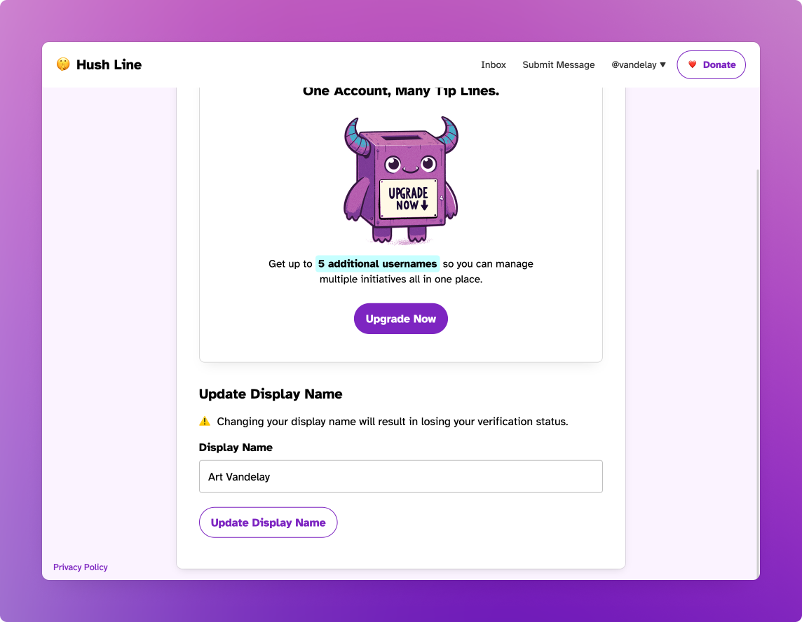 

## Sending Messages

When you log in to your account, click on the "Submit Message" link at the top of the screen. You can publicly share the URL for this page wherever you're advertising your tip line. You'll notice some instructional text is only visible to you with suggestions for sharing your address. 

You'll also see a message indicating if you've uploaded a PGP key. This will be visible to someone submitting a message, so if you'll receive sensitive information, it is advised to add your public PGP key in Settings. 

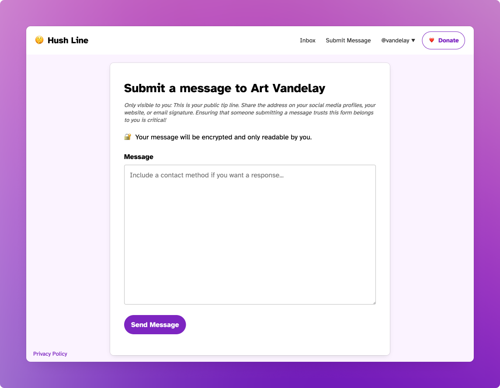

When you share the address, someone sending a message will see slightly different text, with voice and tone directed at them.

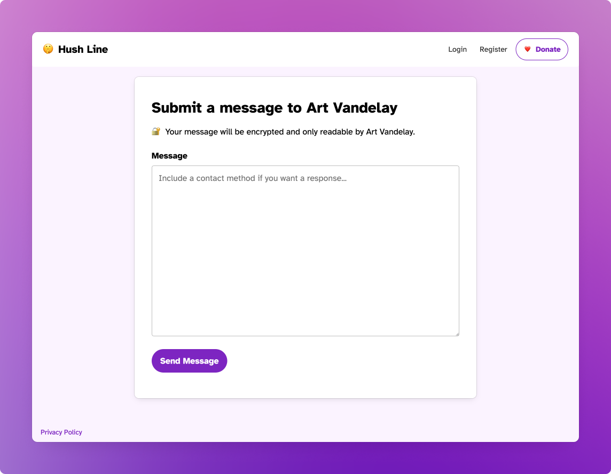

If you haven't added a PGP key, you and any visitor will see a warning that messages will not be encrypted.

### Your IP Address

You'll notice an IP address displayed at the bottom of the submit message form. If you ARE NOT using <a href="https://torproject.org/download" target="_blank" rel="noopener noreferrer">Tor Browser</a> or an anonymizing VPN and you're browsing from home, the address you see is most likely yours. It's trivial for a law enforcement agency to learn your exact identity from your ISP by simply subpoenaing for that information.

WHILE WE DO NOT LOG ANY IP ADDRESSES, if an attacker were actively monitoring connections to the site, they'd be able to see your address. In some cases, this might be enough to de-anonymize yourself. If you ARE using Tor, the observable IP address will belong to one of the thousands of possible addresses on the Tor network. And since there is no predictable way to determine the origin of a Tor connection, the IP address connecting to the site can not be linked back to you.

For these reasons, we highly recommend using the Tor Browser to help ensure your privacy.

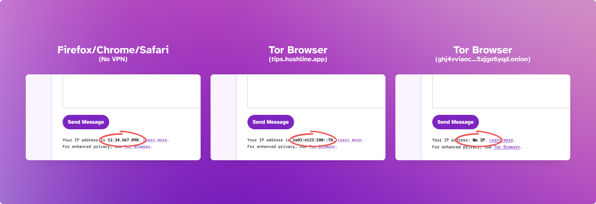

## Reading Messages

New users are greeted by their empty inbox.

When you receive a message, they'll appear here. 

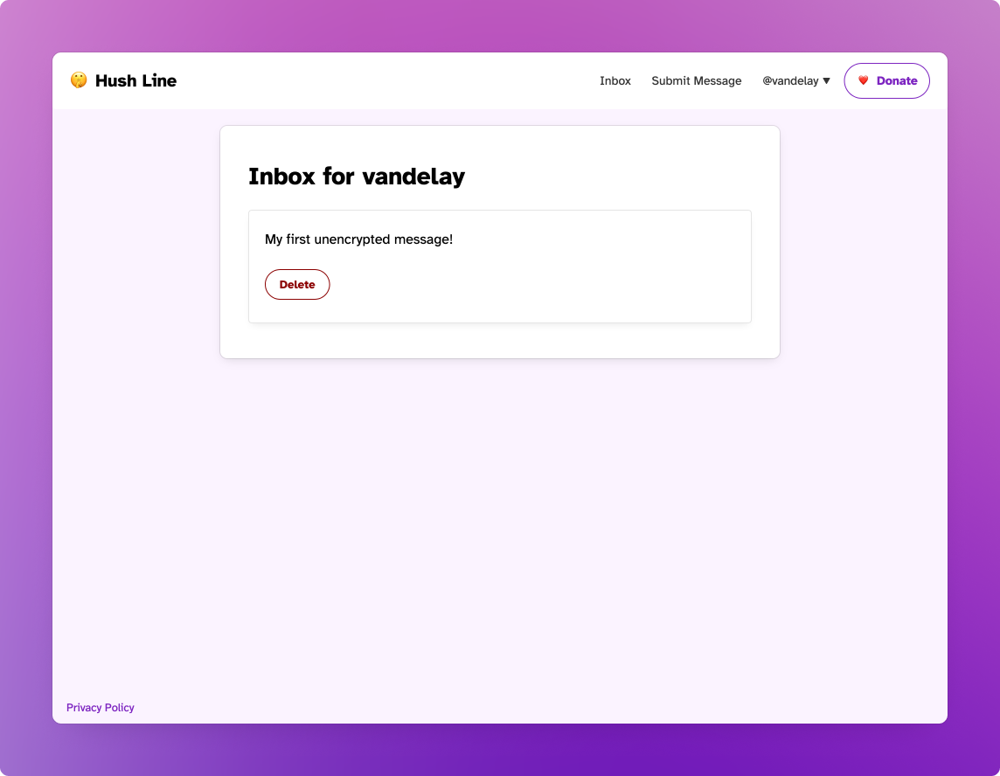

### Message Encryption

By default, Hush Line doesn't require a PGP key, but it's strongly encouraged. After adding your PGP key, only you can read the messages you receive. 

As a baseline security measure, we encrypt your message content by default on our server. While this protects the contents of our database, if the encryption key becomes compromised, it can be decrypted. But if you add your PGP key, any message received will only be able to be decrypted by you. If you expect to receive messages containing sensitive content, enabling this feature is strongly encouraged.

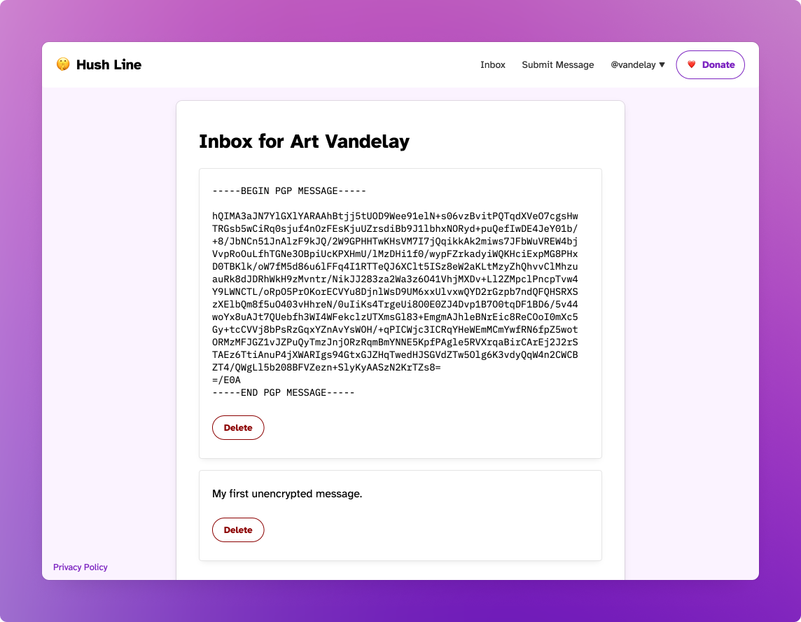

### Mailvelope

After installing the Mailvelope extension in your browser, you can decrypt your messages directly in the app. This is highly recommended, as it's one of the easiest and most straightforward methods of decrypting your messages. 

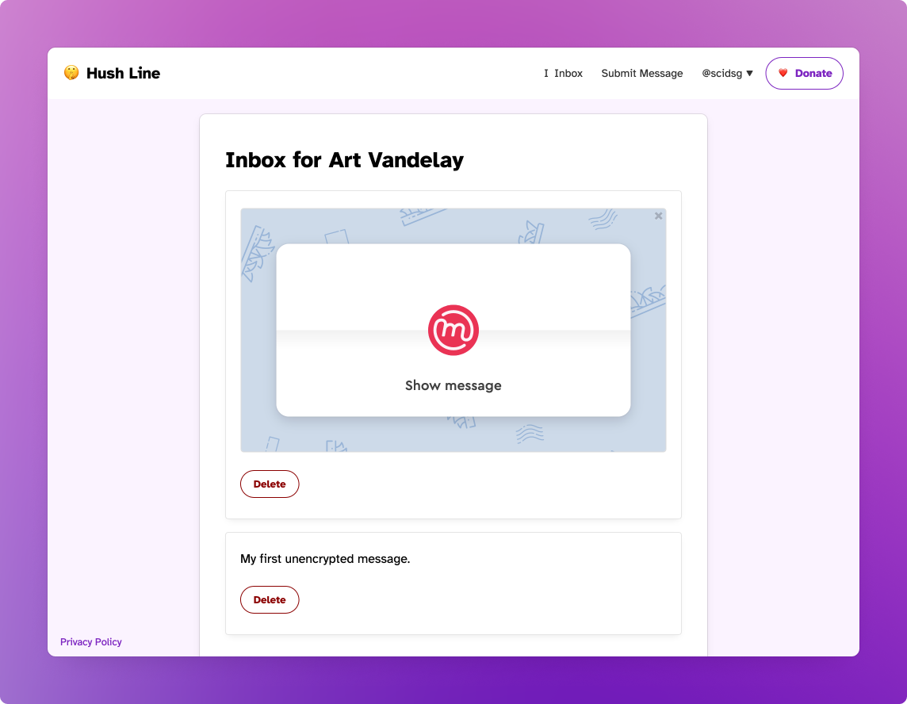

You'll see a new interface where the encrypted message was. Click "Show message" to decrypt. You'll enter the password you created when setting up your PGP key, and the contents will be visible. 

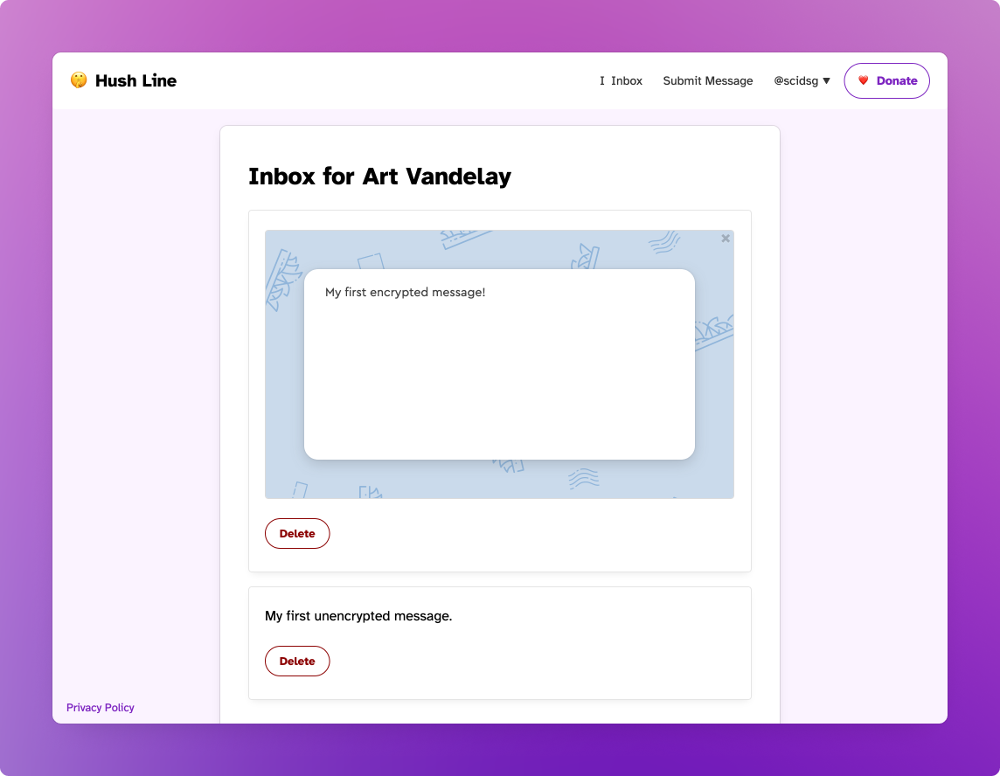

## Settings

### Profile Settings

Users can tailor Hush Line to their needs, from adding a display name to adding multiple usernames.

#### Display Name

Users can set a human-readable display name so that someone submitting a message can see "Submit a message to Science & Design" rather than "Submit a message to scidsg".

##### Verification

As a security measure, if a user changes their display name after verification, they'll lose that status and must re-verify their account.

### Authentication

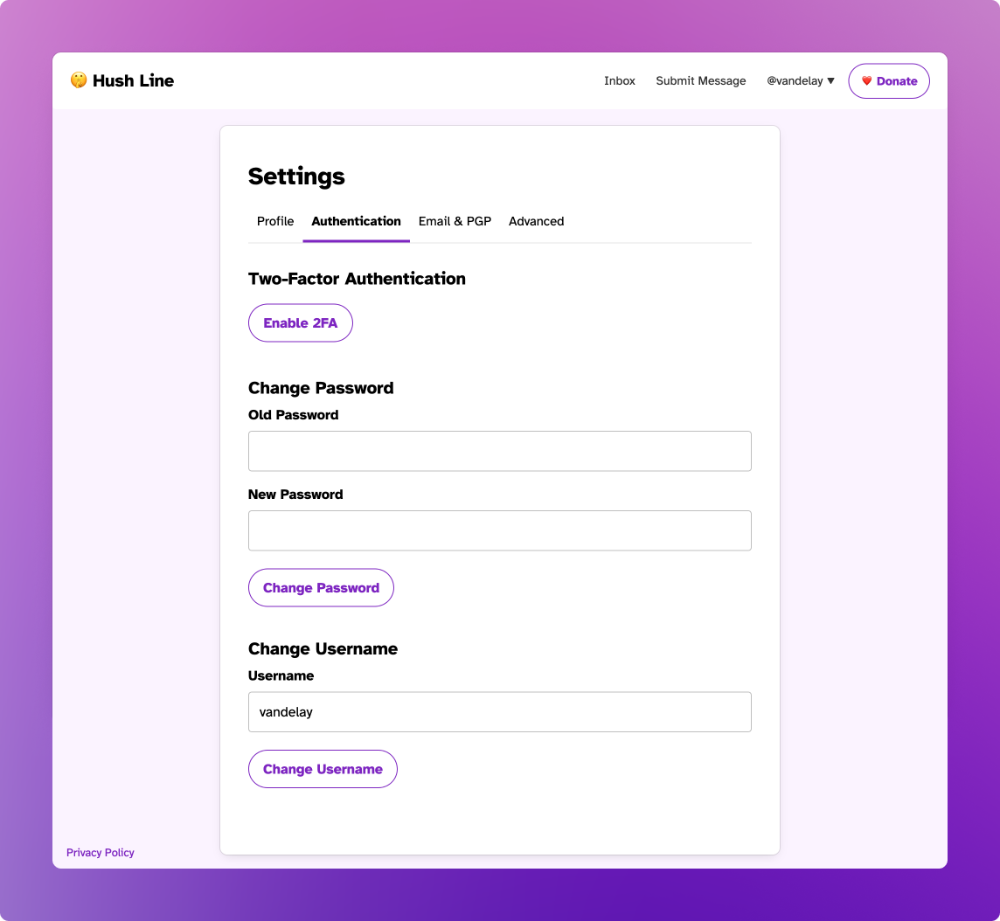

#### Two-Factor Authentication

To improve account security, users can enable two-factor authentication, making account compromises, even in the event of a password leak, impossible.

#### Change Password

Users can change their password when needed.

#### Change Username

Changing your username is easy but can lead to confusion for end-users, especially for well-known organizations.

##### Verification

Like when changing your display name, when you change your username, you'll lose verification and need to go through the process again.

### Email & PGP

#### Email Delivery

Users can have messages delivered to an email address and with the SMTP service of their choosing.

#### PGP

Users can opt to have their messages encrypted so they're only readable by them. This is a highly encouraged option, especially for journalists.

### Advanced

#### Delete Account

Easily and permanently delete your account whenever you want. 

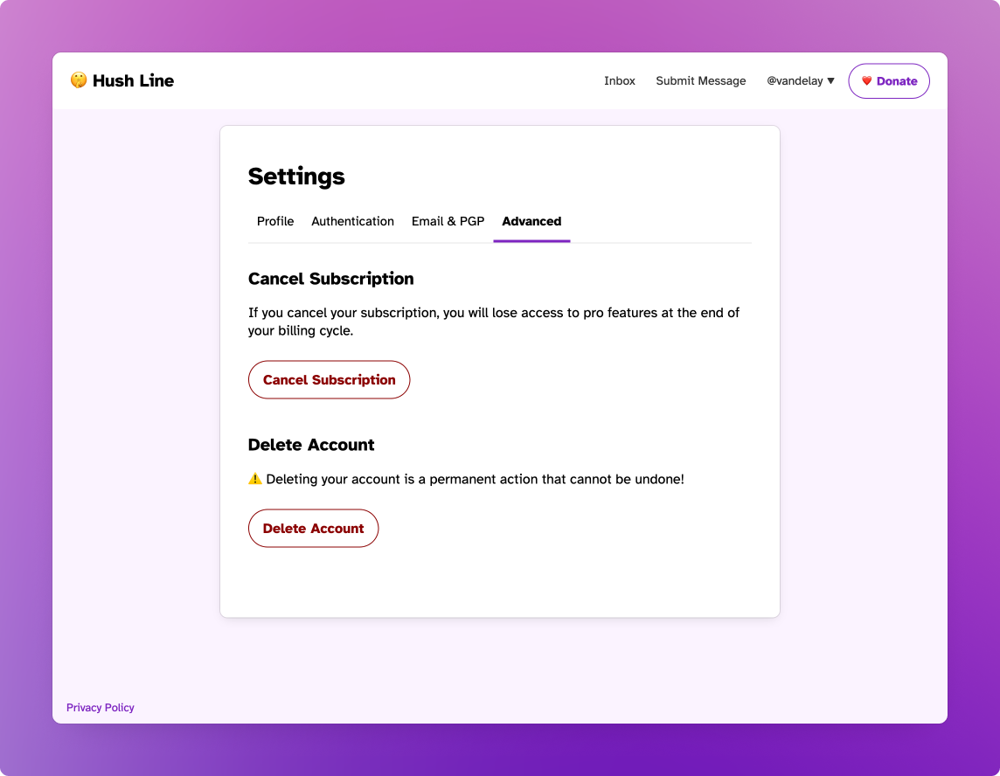

## Admin View

Admins can control certain aspects of user settings without having to log in to the server or manually modifying the database. This is where users are verified, where paid features can be manually enabled, or where admins can be created.

A highlight panel displays the total number of users and how many have enabled 2fa or added a PGP key. This view helps with internal decision-making, like education campaigns for security best practices.

## Paid Features

### Additional Usernames

Paid users can add up to five additional usernames. This feature aims to make it easy for organizational users to manage multiple initiatives from the same account. Newsroom editors can have lines for politics, cybersecurity, or world news desks; an educational institution can have lines for students, faculty, or community channels.

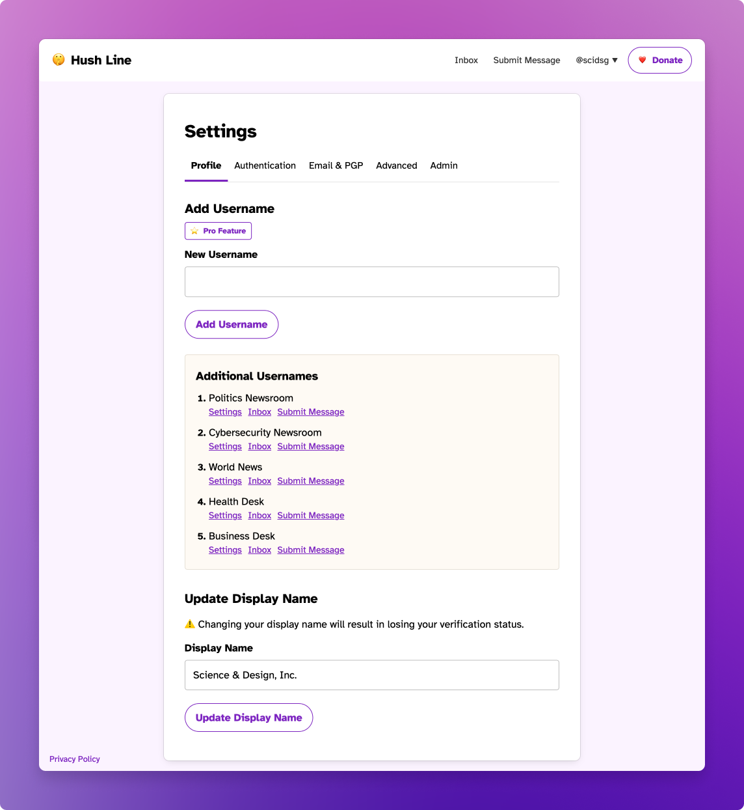

### Inbox

The account's primary inbox will aggregate and label messages in a single view.

#### Secondary Inboxes

Account owners can navigate to their secondary username's inboxes from the settings page.

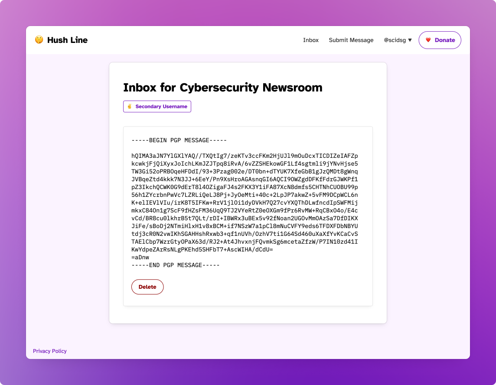
