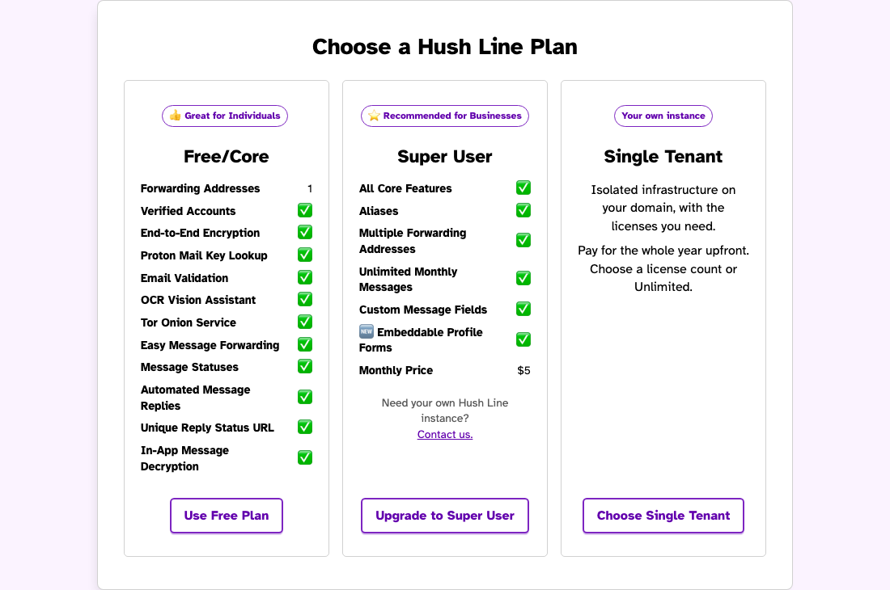
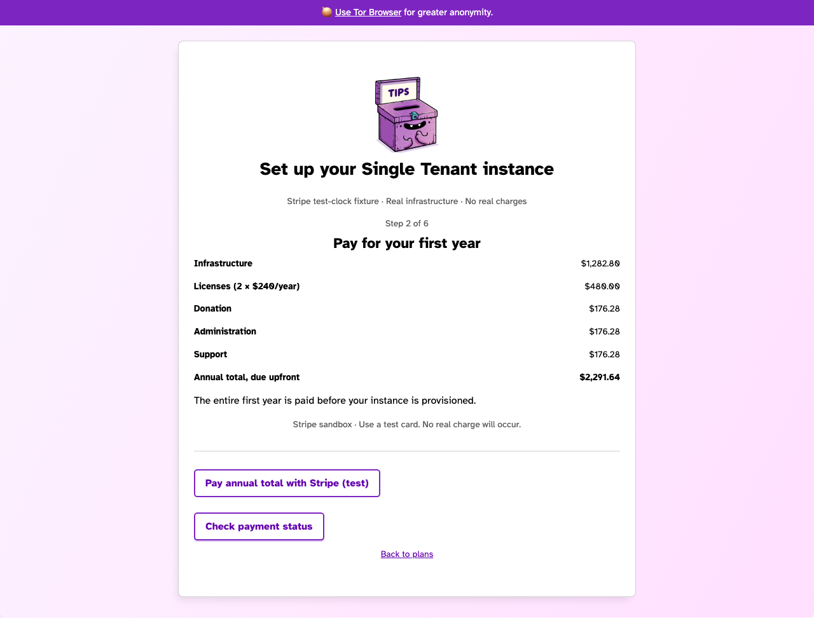

# Single Tenant operation and launch

Single Tenant is disabled by default. Existing Free and Super User subscriptions
continue to use their existing integration. A Stripe dashboard view does not
change the credentials used by an application.

## Configuration and separation

`SINGLE_TENANT_ENABLED` enables account-bound setup and management.
`SINGLE_TENANT_ACCEPT_PAYMENTS` separately opens new annual checkout; leave it
false to stop new purchases while existing lifecycle work continues.
`SINGLE_TENANT_SERVICE_URL` must be an explicit HTTPS origin and
`SINGLE_TENANT_SERVICE_KEY` a dedicated 32-byte shared key, stored in approved
secret storage. Requests are signed, bounded, non-redirecting, and account/order
bound. Never reuse an application, database, session, cloud or SMTP secret from
production in staging. SMTP uses dedicated single-tenant credentials, STARTTLS,
and certificate verification.

Test mode permits only the reserved loopback clock controller. Its fixed order
and physical database are independently checked. Its Stripe customer metadata
and authoritative test clock must match before expiry. No general backdating
control exists. Sandbox configuration must never become a production fallback.

## Normal lifecycle

1. Authenticate the portal account and select Single Tenant.
2. Pay the complete annual total through hosted Stripe Checkout. Independently
   verify the paid invoice, recurring annual components, customer and order.
3. Submit the customer domain once. Persist the private Git revision and signed
   public request before publication; transport recovery republishes only the
   same revision. Never interpret a redirect as payment authorization.
4. Create only new order-owned project, app, database, build branch and workspace.
   Refuse adoption, imports, replacements and existing-name collisions. Verify
   the saved create-only Terraform plan before applying it.
5. Show DNS and deployment health separately. Require explicit Continue clicks.
   Keep successful checks visible while status transport is unavailable.
6. Release the encrypted administrator invitation only to the owning account
   after health verification. Do not log, screenshot or include it in URLs.
7. Save cancellation intent before contacting Stripe. Run
   `flask single-tenant-reconcile` as a persistent worker. Account deletion
   unlinks the portal identity but retains this independent obligation.
8. At the verified paid-through date, the normal expiry worker automatically
   publishes retirement. Use the exact guarded saved service-deletion plan;
   verify app/database absence and empty membership before the refreshed saved
   project-deletion plan. Verify provider absence and empty Terraform state
   before removing only the empty owned workspace.

## Recovery and monitoring

Treat publication, provider creation, initialization, HTTPS, onion verification,
claim and retirement as separate stages. Monitor worker heartbeat, oldest pending
publication/cancellation, failed Stripe reconciliation, workflow age and verified
retirement. Logs contain order IDs and sanitized error categories, never payment
identifiers, credentials, email addresses, invitations or message contents.

For a stalled request, inspect the original order and immutable Git revision
first. Preserve failure history. Do not create a replacement, resubmit a hostname,
rerun Terraform, alter a billing term, manually delete resources, bypass an
existing-workspace guard, or repair the ledger to make a test pass. Any recovery
is explicitly recorded as a recovered attempt.

Before enabling sales, require passing CI, security scans and an uninterrupted
sandbox checkout-to-natural-expiry deletion rehearsal with independent resource
absence evidence. Confirm live Stripe keys and webhook signatures are isolated
from test keys, reconcile renewal success/failure without shortening a paid year,
and retain the currently working dedicated Riseup notification sender. The proposed
custom sender change was cancelled; it is not a launch dependency. SMTP
acceptance is separate from recipient inbox delivery. Do not infer new sender
alignment from older Riseup-address headers.

## Current activation boundary

The account UI and signed broker contract are prepared with production disabled.
The installed broker is intentionally confined to the reserved sandbox fixture;
it is not a live multi-customer service. Live activation additionally requires a
reviewed dedicated live broker, cloud project/credential scope, live webhook and
renewal reconciliation configuration. The existing sandbox PR workflow is not a
production deployment service. Keep the application and infrastructure draft PRs
unmerged until the complete deployment/configuration diff is reviewed and
explicitly authorized. Do not change production DNS or existing instances.

## Billing transaction guarantees

Annual Checkout uses the application's existing live Stripe configuration and
separate Single Tenant customer/subscription identities. A durable receipt is
reserved before contacting Stripe. The order is locked and refreshed again after
that reservation; an account deletion or cancellation committed in between stops
new Checkout creation. Repeated requests reuse the same Stripe idempotency key.

Payment confirmation refreshes the order under a row lock. If an account is
removed while payment completes, its retained cancellation obligation is
preserved. The cancellation worker can verify the newly paid year without
committing midway: its lock remains held through the renewal acknowledgement.
No signed return URL alone authorizes provisioning.

## Recorded sandbox evidence

The isolated real-app fixture completed account creation, Stripe sandbox annual
payment, administrator claim, cancellation, and automatic retirement after an
owned Stripe test-clock advance to the unchanged calendar-year deadline.
Creation run: https://github.com/scidsg/hushline/actions/runs/37505754333
Retirement run: https://github.com/scidsg/hushline/actions/runs/37509284407
Both cloud workflows succeeded on attempt 1, and the browser confirmed retirement.
The complete rehearsal was recovered: publication required republishing the same
signed request after a service PATH omitted Git LFS. The controller now supplies
a fixed trusted PATH; automatic retirement publication subsequently succeeded.
This evidence does not count as an uninterrupted launch rehearsal or live payment.

## Fresh workflow payment authority

Live workers and Git workflows use a dedicated signed request to
`/internal/single-tenant/billing-authority`. The portal reads the owned Checkout
session and current paid invoice using its existing Stripe configuration; the
workflow receives no Stripe key. Requests are bounded, timestamped, replay
protected in the database, and bound to the exact order and owner. Responses are
private and must not be logged or uploaded as public artifacts.

Provisioning requires an active owning account, an active subscription and a
fully paid calendar year containing actual UTC now. Retirement requires the
same recorded paid year to have expired, confirmed cancellation with no pending
withdrawal, and an independently read terminal cancelled subscription. Past
invoice evidence cannot authorize a new instance or an early deletion. The
endpoint is absent when Single Tenant is disabled or sandbox mode is enabled.

## Sandbox UI evidence

These sanitized images show the account plan selection and full annual Checkout
quote from the recovered sandbox rehearsal. They contain no login, invitation,
DNS verification or payment credentials and are retained as a CI artifact. They
are test evidence, not confirmation that live sales are enabled.

## General controller release

The implementation is in `scripts/single_tenant_live_worker.py` and the signed
API factory in `scripts/single_tenant_live_service.py`. It is not installed or
activated by importing these modules. Use a physically new, owner-only encrypted
SQLite ledger on the mounted external volume; initialization refuses any existing
file. Keep its encryption key and distinct portal/workflow signing keys in the
approved internal secret store. Persist those keys across restarts.

Private controller configuration names its namespace (`hushline-single-tenant`),
ledger and key paths, approved HTTPS billing authority, explicit `accepts_payments`
flag, and publisher app/infra paths, immutable reviewed commit SHAs, external
artifact directory and internal SSH signing identity. The API is a WSGI factory
(`scripts.single_tenant_live_worker:create_app`); run the separate worker with
`python -m scripts.single_tenant_live_worker` and an explicit
`SINGLE_TENANT_CONTROL_CONFIG` path. Neither process creates a database implicitly.
The worker checks release readiness every 30 seconds. Checkout also checks the
controller's recent healthy heartbeat and explicit sales flag.

Install both reviewed workflows on the default branch, with repository variables
`SINGLE_TENANT_SOURCE_SHA`, `SINGLE_TENANT_INFRA_SHA`,
`SINGLE_TENANT_TF_ORGANIZATION`, `SINGLE_TENANT_TF_PROJECT`,
`SINGLE_TENANT_DO_TEAM_ID`, `SINGLE_TENANT_AUTHORITY_ORIGIN`, and
`SINGLE_TENANT_CONTROL_ORIGIN`. The team UUID must match HushLineDev; the HCP
project must be named `Hush Line Single Tenant`. There are no provider defaults.

The isolated `single-tenant-automation` GitHub environment must allow only branch
`main`, without required reviewers, wait timers or custom approval rules. Store
only its dedicated `SINGLE_TENANT_CONFIG_READ_TOKEN`, `SINGLE_TENANT_DO_TOKEN`,
`SINGLE_TENANT_TF_TOKEN`, `SINGLE_TENANT_PORTAL_KEY`,
`SINGLE_TENANT_WORKFLOW_KEY`, and `SINGLE_TENANT_SMTP_JSON` there. All six roles
must be present in this environment. Repository-level staging or production
credentials cannot satisfy the release gate, including private configuration reads.
The config token
reads the private infrastructure repository; the cloud tokens must cover only the
approved customer project/team. The DO token requires account-read permission
for team verification. The HCP token requires plan JSON and owned-workspace
operations. No Stripe key enters the controller, Git requests or cloud jobs.
Retain the existing dedicated notification configuration; this release changes
no sender addresses.

The legacy PR #2447 workflow is disabled during credential-boundary remediation.
Before enabling it, restrict `self-service-test-2447` to branch `main` and install
dedicated `SELF_SERVICE_TEST_DO_TOKEN`, `SELF_SERVICE_TEST_TF_TOKEN`,
`SELF_SERVICE_TEST_CONFIG_READ_TOKEN`, and `SELF_SERVICE_TEST_STRIPE_KEY` in that
environment. It uses the trusted base-branch workflow and validators; the PR
checkout supplies request data only. Keep the existing environment SMTP roles
restricted there. Do not substitute customer automation or repository-level
staging credentials. Review historical runs and provider audit logs, then rotate
the previously exposed staging credentials without interrupting other consumers.

The request-validation workflow handles only create-only signed pointer commits.
The privileged lifecycle runs trusted default-branch code, independently checks
the private signed request, and applies an exact saved guarded plan. It never
executes code from a customer request branch. Result artifacts contain encrypted
per-order envelopes; invitations, payment evidence and credentials are excluded
from public commits and artifact plaintext. Lost callbacks are reconciled from
those original artifacts. A stalled publication reuses its locally retained
original signed commits with create-only remote leases. Neither path reruns a
cloud operation.

Release is incomplete until these source changes have passed final CI, their
configuration is independently reviewed, and the customer controller has passed
a full uninterrupted isolated lifecycle rehearsal. The current installed sandbox
controller and existing instances remain unchanged. Production deployment and
opening live sales remain outside this preparation step.

## Read-only installation preflight

`Single Tenant read-only preflight` runs only trusted default-branch code in the
customer environment, using the approved development credentials directly. It
checks the DigitalOcean account is active and belongs to the dedicated
HushLineDev team ID before any Terraform query. It discovers only the dedicated HCP customer project in
hushline-single-tenant and verifies its exact project ID and organization. Output contains sanitized
team/project metadata or an exact failure stage. It never creates a project,
workspace or customer resource, submits a payment, enables checkout, or exposes
credentials. Manual dispatch is an operator diagnostic, not a customer approval
or a provisioning retry. A missing project remains a setup blocker.

## Dedicated provider accounts

Customer automation is pinned to the independently created HushLineDev team
and hushline-single-tenant HCP organization, with project Hush Line Single
Tenant. The read-only preflight verifies the exact team and project IDs, so
matching names cannot authorize another account or adopt another project.
Both provider tokens must be dedicated environment secrets; shared staging
provider tokens cannot substitute. The existing approved development GitHub
PAT may only supply private infrastructure-configuration read access.
Customer resources are still created only after verified annual payment.
