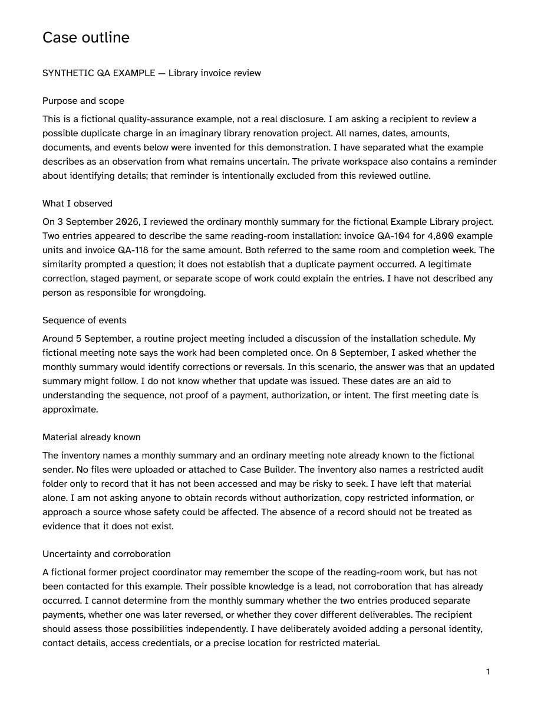
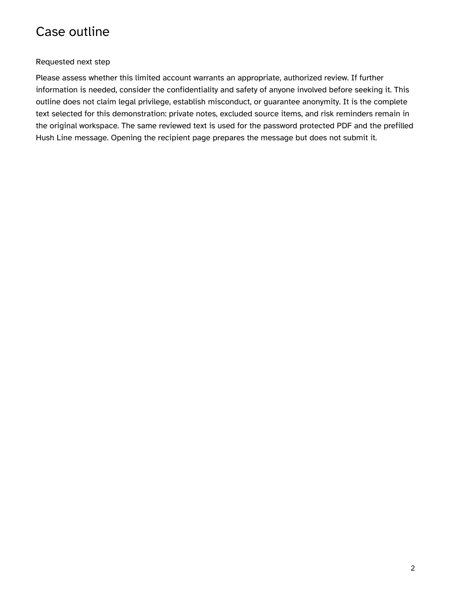
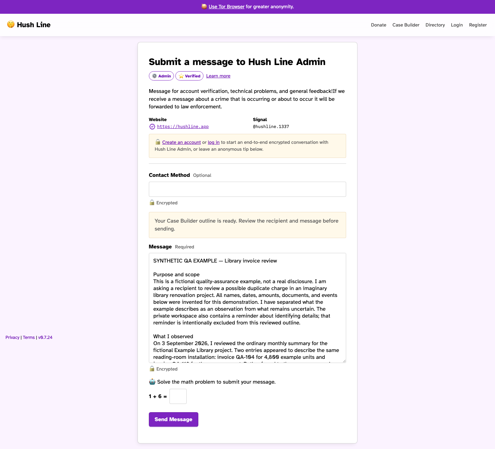

# Case Builder PR evidence

Captured from the local development app with Chromium. All case text is fictional QA
data invented for these screenshots. No records were sought, accessed, copied, or
attached. The seeded recipient is a local test account. The tip was prepared but not
submitted.

## Completed workspace

[Full filled workspace](./01-completed-workspace.png).
The fixture includes saved records, review markers, connections, and a six-part
reviewed narrative. Editor fields also contain sample values; unsaved editor values
are not additional exported records. The private identifying-detail reminder is
excluded from the output.

| Section       | Screenshot                                                         |
| ------------- | ------------------------------------------------------------------ |
| Notes         | [Filled notes and private reminder](./02-notes.png)                |
| Claims        | [Claim with review marker](./03-claims.png)                        |
| Timeline      | [Date, approximate-date control, and event](./04-timeline.png)     |
| Evidence      | [Inventory including material left alone](./05-evidence.png)       |
| Corroborators | [Unconfirmed possible knowledge](./06-corroborators.png)           |
| Connections   | [Links between saved items](./07-connections.png)                  |
| Review        | [Risk checks and reminder](./08-review.png)                        |
| Narrative     | [Reviewed six-part outline](./09-narrative.png)                    |
| Output        | [User-chosen PDF password and action review](./10-next-action.png) |

## Actual generated PDF

[Download the encrypted PDF](./case-outline.pdf).
The deliberately public test password is `Synthetic QA PDF password 2026`.
This is the downloaded browser output, not a separately recreated document.

Independent `pypdf` parsing verifies AES-256 revision 6, rejects blank and incorrect
passwords, and checks every paragraph against the
[exact reviewed outline](./reviewed-outline.txt). PyMuPDF renders both pages after
password authentication. Rendered screenshots expose the fictional example text and
are intentionally unencrypted.





## Recipient page

The browser test checks the complete textarea value against the reviewed outline and
asserts that no POST occurs on transfer. The original workspace remains open.



[Expanded message field](./12-tip-message-expanded.png) and
[end of transferred message](./13-tip-message-ending.png) show the longer payload.
The native textarea was expanded with its resize handle for inspection.

## Responsive layout

The populated form is checked at 320, 390, 640, and 768px. Every visible textarea must
fit its parent and viewport, the ribbon must fit its container, and selecting the
last tab must not scroll the document horizontally.

| Width | Notes                           | Last tab                                    |
| ----- | ------------------------------- | ------------------------------------------- |
| 320px | [Notes](./mobile-320-notes.png) | [Next action](./mobile-320-next-action.png) |
| 390px | [Notes](./mobile-390-notes.png) | [Next action](./mobile-390-next-action.png) |
| 640px | [Notes](./mobile-640-notes.png) | [Next action](./mobile-640-next-action.png) |
| 768px | [Notes](./mobile-768-notes.png) | [Next action](./mobile-768-next-action.png) |

The navigation uses the app's shared Settings classes. A separate browser test
compares desktop styles and the mobile divider-to-heading gap directly against the
actual Settings page, including at 320, 390, and 640px.

[Case Builder at 390px](./case-builder-mobile-390.png) and
[Settings at 390px](./settings-mobile-390.png) show the matched 28px spacing from the
tab divider to the section heading. The desktop comparison is available for
[Case Builder](./case-builder-navigation.png) and [Settings](./settings-navigation.png).

Record counts reuse Inbox's active and inactive badge styling:
[Case Builder badges](./case-builder-count-badges.png) and
[Inbox badges](./inbox-count-badges.png). The browser checks compare their computed
styles directly and verify added records, unsaved text, confirmed deletion, and zero
counts. Review counts reflect reminders and narrative counts reflect outline pieces.

## Reproduce

With the seeded local development app running on port 8080:

```sh
npm run playwright:e2ee -- tests/playwright/e2ee/case-builder.spec.js tests/playwright/e2ee/case-builder-pr-artifacts.spec.js tests/playwright/e2ee/client-side-encryption.spec.js
```

The screenshot scenario is `case-builder-pr-artifacts.spec.js`. Playwright places the
fresh PNGs, PDF, and outline under `test-results/playwright-e2ee/`. Other checks cover
new-account self-send through signed E2EE chat, decryption, and retry deduplication.
